# Гайд по моду Witchery

#### Предисловие

Всем добрый день, на этот раз этот гайд будет для начинающих ведьмаков и ведьмочек, тем, кто любит проклятия, зельеварение, куклы вуду и тому подобные вещи. В общем, гайд будет делиться на несколько частей, ибо, ну.. большой по объёму, не сильно, но прилично!) Начнём 

## Растения

С чего же начинать?

После того, как вы появились на сервере (мире) вы разумеется идёте искать территорию, нашли? Что мы начинаем делать в первую очередь? Правильно – чистить территорию.

Сейчас мы переключаем внимание на траву, да, да, на зелёную такую, красивую.

Ваша задача начать её ломать, ломать и ещё раз ломать. Дело в том, что модификация Witchery добавляет нам новые семена для различных крафтов и рецептов. Когда вы сломаете приличное кол-во травы, вы обнаруживаете у себя в инвентаре семена пшеницы, но теперь с небольшим шансом могут выпасть и другие семена, а именно:

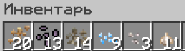

Начнём по порядку:

1. Семена Мандрагоры:  
  Посадка: Вспаханная земля и рядом должен быть источник воды. Когда вы начнёте собирать мандрагору, то есть шанс, что появится сама Мандрагора и начнёт орать и бегать как сумасшедшая, параллельно бить вас и накладывать эффект тошноты.  
  Дроп: Те же семена Мандрагоры и Корень (Цветок) мандрагоры.


2. Семена Белладонны:  
  Посадка: Вспаханная земля и рядом должен быть источник воды.  
  Дроп: Те же семена Белладонны и Цветок Белладонны


3. Семена водного Артишока:  
  Посадка: Этот цветок растёт на воде.  
  Дроп: Те же семена и Клубень Водного Артишока


4. Семена Подснежника:  
  Посадка: Вспаханная земля и рядом должен быть источник воды.  
  Дроп: Те же семена, Снежок и Сосулька.


5. Семена Волчьего Аконита(Wolfsbane):  
  Посадка: Вспаханная земля и рядом должен быть источник воды.  
  Дроп: Те же семена и Клубень Волчьего Аконита.


6. Семена Чеснока (Garlic):  
  Посадка: Вспаханная земля и рядом должен быть источник воды.  
  Дроп: Вы сажаете чеснок и получаете взамен чуть больше чеснока, логично? Логично.

Все семена по перечислению (1 - 6)
Сзади слева находится Волчий Аконит, а сзади справа Чеснок

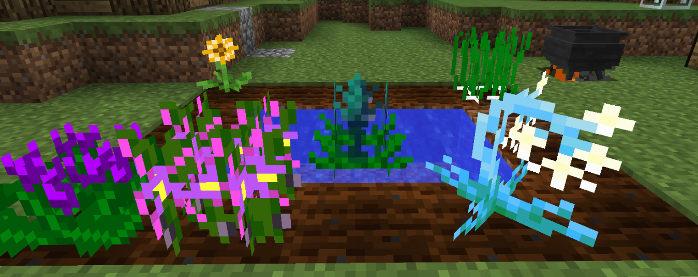

---

## Ведьмина печь

Как только мы запаслись всеми семенами и их ингредиентами – смело идём создавать Ведьмину Печь.

Создаётся она просто:

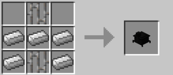

Её интерфейс выглядит так: 

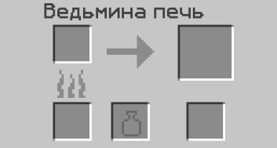

Для её работы нам нужны глиняные кувшины.
Основа их крафта это Кувшин из мягкой глины

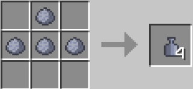

В дальнейшем этот кувшин из мягкой глины мы берём и кидаем в обычную печку на обжарку и уже получаем готовый Глиняный Кувшин.

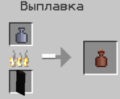

Печка эта не пережаривает руду. Её работа основана на прожарке саженцев различных деревьев, брёвен и еды. Как вы заметили, у неё есть несколько слотов, верхний слот справа – это слот 100% результата после прожарки, слот справа ниже – это уже не 100% шанс, как вы догадались.

В пример возьмём обычный Саженец Дуба, его 100% дроп – это древесный прах. А вот в слот ниже уже идёт такой особо важный ингредиент «Выдох Демона». Это скорее какая-то ароматическая настойка..

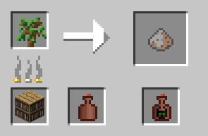

С таким же успех можем взять Курятину. 100% дроп – это Жаренная Курица, в ингредиент же идёт настойка под названием «Вонючий Дым» и так далее. 

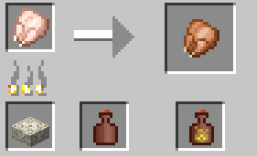

А ещё, если вы нажмёте на стрелочку по середине, то можно посмотреть все рецепты, которые производятся в этой печи. 

Cписок всех предметов и какие настойки они дают:

- Дуб – Выдох Демона
- Берёза – Дыхание Богини
- Ель – Сила Возрождения
- Рябина – Дуновение Магии
- Боярышник – Благоухание Чистоты
- Ольха – Запах Неудачи

---

## Ведьмин котел

Следующим этапом будет – Ведьмин Котёл (Witch’s Cauldron). Делается он не так уж и тяжело.
Нам нужен обычный ванильный котёл из обычного майнкрафта, пока вы его поставите и приготовите для готовки, мы тем временем начнём делать специальную смазывающую массу, а конкретно – Anointing Paste.

Создаётся она из 4х семян добавляемых модом витчери, вот крафт: 

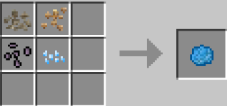

Эту Смазывающую пасту мы используем на ванильный котёл ПКМ и в результате он становится ведьминым, ну, а чтобы котёл уже полностью функционировал: завершающими действиями будут:

1. Копаем под котлом блок , ставим адский камень и поджигаем его – это топливо. 
2. Котёл должен быть наполнен водой и полностью! (3 ведра для полного заполнения): 

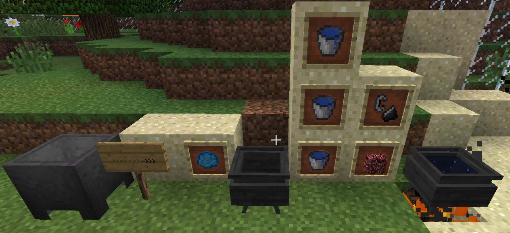


Для чего мы вообще создавали этот котёл? А для дальнейшего развития в «ведьмологии» так скажем.

Модификации Witchery по мимо природных ресурсов(семян) добавляет ещё и 3 вида деревьев, но к сожалению их получить можно только двумя способами:

1. Искать в данжах
2. Cоздать с помощью Мутандиса. 

Мы же будем рассматривать способ под номером 2.
В этом котле мы как раз таки и будем создавать этот мутандис. Создаётся он с помощью 3х ингредиентов: 

1. Цветок Мандрагоры
2. Выдох Демона
3. Обычное Яйцо

Сама схема проста, кидаем предметы в котёл, НО! Тут очень важна очерёдность, первым обязательно нужно кинуть мандрагору, вторым выдох демона и так далее, будьте внимательны.


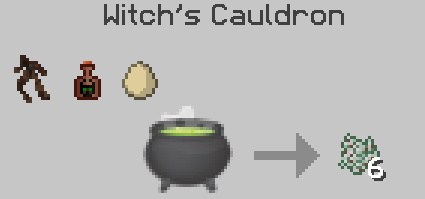

Что вообще такое Мутандис и для чего он нужен? Ответ опять же прост..

Мутандис – это подобие костной муки, но с другим функционалом. Мутандис позволяет случайным образом изменить цветок или же саженец дерева на какой-либо другой.

Давайте в пример возьмём обычный ванильный одуванчик: (А перед началом запаситесь ножницами, вы просто поблагодарите меня за это, т.к. могут попадаться нужные растения, которые получить можно только с помощью ножниц)

Ставим его, клацаем ПКМ этим мутандисом и чудо, одуванчик превратился в саженец Рябины(а она то нам и нужна)!!!

На самом деле тут не так уж и легко добыть нужное вам растение, запаситесь эти мутандисом и мутируйте растения, чтобы получить нужные, в принципе это все его свойства.

Кстати, чуть не забыл. Добавляет Витчери 3 вида деревьев:

1. Рябина

2. Боярышник

3. Ольха


---

## Перегонный куб и Алтарь

Ну, нам по идее нужен перегонный куб, но без алтаря он разумеется, работать не будет. Мы это исправим. Алтарь в витчери – это мультиблочная структура. Блок создаётся вот так:


В создании используются брёвна рябины, выдох демона(справа) и дыхание богини (слева).
Один крафт даёт нам сразу 3 блока. А нам нужно 6. После того, как мы их сделали, ставим их вот так:


Если вы всё правильно поставили, то алтарь покроется красной скатертью.

---

### Энергия Алтаря

Когда мы открываем алтарь (пкм) мы видим там такие значения: (На пример)

```
692 / 771(x1) 
```

- 692 – это текущее количество вашей энергии, оно будет тратится при использовании и медленно повышаться от некоторых предметов и от окружающей среды.
- 771 – это максимальный уровень энергии, выше  этого значения энергия подниматься не будет. Это значение можно увеличить  некоторыми предметами( Об этом позже)
- (х1) – это скорость повышения энергии. Опять же зависит от предметов и окружающей среды.
    - Окружающая среда  - это среда, к которой относятся блоки травы, цветы, деревья, а самые главные деревья – это Ольха,  Рябина и Боярышник. Один типа дерева поднимает максимальный уровень энергии, а также и каждая травинка.

---

### Перегонный куб

Наконец приступим к перегонному кубу. Ставим его впритык к Алтарю.
Создаётся этот перегонный куб так: 


Как вы уже заметили, снизу в крафте у нас неизвестный предмет, называется он «Камень силы».

Камень силы создаётся вот так:


Дуновение магии, алмаз и ведро лавы. Дуновение магии же создаётся в ведьменной печи посредством прожарки рябины


Этот перегонный куб производит более сложные ароматические настойки, да и при этом производит побочные эффекты, скажем так, гипс, сгусток слизи, светопыль и даже песок душ. В дальнейшем нам эти настойки понадобятся.

Интерфейс этого перегонного куба выглядит таким образом:


 
Есть такая книжечка, называется «Ведьмовство: Дистилляция» .

В ней описаны все рецепты в этом перегонном кубе, чтобы получить это, закиньте это и тому подобное. Создание этой книжки простое: 


---

## Мини котелок

Я бы сказал, что это ещё один, очередной котёл ведьмы, но он меньше, и выглядит мило.
В этом котле мы будем варить зелья, отвары и тому подобное.
Чтобы этот котёл работал, ему нужно топливо, а также он должен быть подвешен на 1 блок над огнём.  В общем, смотрим его крафт и схему построения, чтобы он работал: 


Структура построения:


Дальше мы поджигаем камень, наливаем ведро воды в котёл и для удобства можем поставить плиту из булыжника, чтобы не обжигаться от огня.


После того, как вы сделаете зелье, а точнее закинете туда нужные ингредиенты, отвар начнёт выпускать такие эффекты как от убийства слизня и тогда вы должны взять пустой пузырёк и ПКМ зачерпнуть необходимое.


Теперь нам опять же нужна книжечка, которая уже называется «Ведьмовство: Зелья и Отвары».

В ней описаны все рецепты каждого зелья и отвара. Например, зелье из Лианы, ниже написано то, что нужно кинуть в котёл, наполненный и разогретый! Вот в принципе и сам крафт книжки:


 
---

## Зелья, отвары, настои

1. Зелье из Лианы: При броске (ПКМ) на стену, вы мгновенно вызываете лозу, которая там остаётся и висит.


2. Зелье из Паутины: При броске в любое место, вызывается паутина, 5 блоков в виде звёздочки, скажем так.


3. Зелье из Колючек: При броске на землю, вы «призываете» в той области кактус и блок песка.


4. Зелье из Чернил: Кидая на игрока или же на мобов, вы вызываете эффект слепоты.


5. Зелье Проращивания: При попадании в определённую область – «вызывает» столб из боярышника или же рябины, случайный блок  древесины, резко поднимает игроки(моба) вверх, или же себя, если вы оказались под действием проращивания. Грубо говоря создатель столбов из брёвен.


6. Зелье Эрозии: При броске разрушает всё, чего касается. Радиус небольшой.


7. Зелье Возвышения: Ломает один блок там, куда попало зелье и призывает зомби, свинозомби или же скелета, в общем, нежить, может даже 2 сразу призвать или 3.


8. Зелье Абсурда: Выпив его, у вас появится голова демона, вам будут боятся мирные мобы и отходить от вас, если вы близко подошли, а также пауки не смогут на вас нападать ночью, а днём также будут бояться. 


9. Зелье Любви: Кинув его на 2х мобов (коров, куриц, свинок) вы их так скажем «заставляете» продлить своё род и размножаться.


10. Зелье Мороза: Кинув его, вы создаёте стенку изо льда в высоту 3х блоков, а если зелье попадёт в жидкость,(вода или ещё что-то) то она за морозится, не вся, но в приличном радиусе.


11. Зелье Глубин:  Выпив его, получаете эффект Дыхания под водой на 4 минуты и Иссушение на 2-3 секунды, которое снова будет вас иссушать, пока вы не будете под водой.


12. Зелье Инфекций:  При броске на цель, наносит ей урон, а также замедляет. Если кинуть на жителя, тот превращается в зомби.


13. Настой Сна: Выпив его, вы попадаете в своё сновидение. В основном мире вы лежите, как на кровати и вас могут убить, будьте осторожны(подробнее об этом будет в других частях)


14. Настой Преследующего Духа: Об этом тоже чуть позже.


15. Настой Транжиры: Накладывает на цель эффект отравления и голода, может даже поджечь.


16. Варево Летучих Мышей: При броске в область, взрывается и призывает 8-10 летучих мышей, а также замедляет тех, кто попал в область взрыва.


17. Настой Замещения: Заменяет определённую область блоками, которые лежат на земле в виде дропа. То есть мы кинули стак булыжника на землю и кинули это зелье, в итоге блоки травы заменились на булыжник, а вместо дропа булыжника у нас теперь валяются блоки травы. 


18. Настой Открытий: При броске в определённую область, а лучше в мобов, которые невидимы – раскрывает их. Есть в витчери мобы, под названием полтергейсты, они вообще невидимые, а этот настой как раз таки делает их видимым. Он раскрывает даже под эффектом невидимости.


19. Отвар из Жабьих языков: Взрывается при броске в блок, а если в его область попали мобы или же игроки, то они автоматически подпрыгивают к вам, ну или же их подталкивает ваша магия.


20. Отвар Погребов: Вызывает 3-4 совы, если зелье попало в какую-либо цель. Совы начинают атаковать цель, наносят 2 урона.


21. Отвар Проклятого прыжка: Подбрасывает цель в воздух на 6-8 блоков и даёт эффект прыгучести 4 на 10 секунд.


22. Застывший дух: Выпив его, вы получаете эффект ночного зрения 2 и существа, называемые «Дух» не будут бояться вас 30 секунд и вы сможете их словить. Но подробно об этом в других частях.

23. Суп из Редстоуна: Нужна нам для создания некоторых предметов и для ритуалов, а если его скушать, то получите эффект повышенного здоровья 2 на 1:30 минуты.


Остальные мази и зелья нужны для зачарования ритуалов, так что о них в других частях. 
Хочу отметить, что некоторые зелья требуют энергии.

---

## Магия кругов

Каждая ведьма или же ведьмак, должны быть приспособлены к магическим силам. Для этого они должны проводить ритуалы и чем больше – тем лучше. Давайте начнём подготовку к этому церемониальному ритуалу!

Для начала нам понадобится книжка, которая называется «Ведьмовство: Магия кругов»


там описаны все ритуалы,  которые нам потребуется и которые в дальнейшем мы будем изучать. В создании ритуала играют большую роль круги, а эти круги мы рисуем с помощью мелков.

Всего 4 вида мелков:

1. Ритуальный мел (Белый, обычный).

    

    В середине используется предмет под названием «Гипс». Гипс мы получаем посредством перегонки Вонючего дыма и Извести

    

    Известь делается уже древесного праха - просто кидаем её в верстак

    

    Наверху по середине используется настойка «Слеза Богини». Создаётся она в том же перегонном кубе 

    


2. Мел потустороннего мира (Фиолетовый) . (скрин). Создаётся в ведьменном котле.

    


3. Адский мел (Красный). (скрин). Создаётся в ведьменном котле.

    


4. Золотой мел (Середина круга, основа). (скрин). Создаётся в ведьеменном котле.

    

В каждом ритуале требуется свой круг, он может быть адским, потусторонним или же обычным, но в любом круге должен быть центр, а именно – золотой мел, он является активатором ритуала.

Рисовать все эти круги просто, мы берём мел в руки и клацаем ПКМ по блоку, там у нас появляется символ. Отсчитайте от центрального золотого «сердца круга» так скажем, 2 блока  и начинайте рисовать малый круг, затем нужно отступить 1 блок и на след. рисовать уже средний круг, та же самая процедура с большим кругом.

---

### Типы кругов

Круги также делятся 3 типа, по размеру:

1. 7x7 – малый круг

2. 11x11 – средний круг

3. 15x15 – большой круг

Ещё немаловажный аспект. Круги должны быть рядом с алтарём, дальше 14 блоков(если я не ошибаюсь, отсчёт идёт от сердцевины круга, то есть от золотого центра) то ритуалы не будут работать.


Первым, что я считаю нужно сделать -  это провести какой-нибудь простой ритуал. Каждый ритуал, пусть и простой, требует энергии, а малое количество энергии нам не нужно, чтобы её повысить, нам нужны специальные предметы, я расскажу о самых легко-добываемых(относительно):

1. Окружающая среда. Выращиваем боярышник, рябину, дуб  и всё засаживаем травкой, с помощью костной муки.

2. Ставим факел или же улучшенную версию факела – Канделябр. Создаётся он вот так: 

    

3. Наполненная чаша.

    

    Для её создания нам нужна обычная чаша, делается она вот так:

    

    В рецепт наполненный чаши входит ещё и Суп из редстоуна, делается он в мини котле вот так:

    

    В крафте супа используются предметы, которые вам неизвестны: 

Язык собаки (выбивается из волков и церберов), капля удачи создаётся в ведьменном котле:


В крафт этой капли удачи входит ещё неизвестный вам предмет – абсолютное зло и Мутандис Экстремес.

Абсолютное зло создаётся в перегонном кубе, с помощью слезы гаста и алмазного испарения


Алмазное испарение создаётся в этом же перегонном кубе с помощью алмаза и купоросового масла


Купоросовое масло создаётся в этом же перегонном кубе с помощью извести и вонючего дыма:


Вонючий же дым делается в ведьменной печи при обжарке дуба.
Мутандис Экстремес создаётся просто, опять же в ведьменной печи:


4. Голова Скелета или же Голова Скелета Иссушителя.
Гарантированно повышение энергии алтаря уже до 3000 и больше, + скорость x4.

---

## Метла

Давайте же приступим; в список обучающего ритуала я решил взять ритуал инфузии. Создание зачарованной метлы, на которой вы сможете летать( о чудо). Страница в книге 62.
Ритуал требует 3000 энергии и ритуал должен проводиться Ночью. Малый и средний круг нарисованный белым мелом. В список требуемых предметов входит:


1. Метла. Создаётся так: 

    

2. Мазь полёта. Она создаётся в мине котле, бросайте эти предметы по очередности, в книге "Зелья и Отвары" они написаны.

    

В середине справа используется шерсть летучей мыши, она выбивается из летучей мыши. Слева по середине зелье скорости(обязательно 8 минут), сверху слева Суп из редстоуна, крафт я описал выше.

И так, приступим: Круг сделали, энергию запасли, теперь мы должны кинуть предметы в центр круга и нажать ПКМ по золотому «сердцу круга», чтобы активировать ритуал.  Ритуал начнёт забирать предметы и после его окончания в центр выпадет не просто метла, а уже зачарованная метла.


Мы можем её «заспавнить». Берём зачарованную метлу в руки, клацаем ПКМ по месту, куда вы её хотите поставить и жмём уже на неё ПКМ, чтобы сесть. 


Управление тут простое, но я считаю, что не очень удобное:

Мы жмём стрелку или клавишу W, то есть клавишу «Вперёд», и она полетит туда, куда мы смотрим. Хотите вверх? Смотрите вверх и жмите «Вперёд», тогда вы начнёте подниматься.Абсолютно также с любыми из сторон, куда вы желаете полететь.

Чтобы затормозить или уменьшить скорость, резко повернитесь назад и нажмите «Вперёд», но старайтесь долго не держать.

Метла сама по себе умная; если вы попытаетесь врезаться в другие объекты, она просто начнёт их облетать автоматически, но бывает и не всегда получается. Вы можете врезаться и сломать метлу.

Левый Shift – спрыгнуть с метлы. (Советую останавливать метлу, когда спрыгиваете, если спрыгнуть на скорости в полёте, то она улетит без вас).

Чтобы вернуть метлу в состояние дропа(вещи в инвентаре) просто дубасьте её ЛКМ.

---

## Лавовый прорицатель и Водный прорицатель

Эти прорицатели предсказывают, что под вами находится.

В данном случаи вода или же лава.

Взяв в руки Лавовый прорицатель, и нажав пкм на блок, на котором вы стоите, то он издаст звук "дзынь", это значит, что под вами лава.

Аналогично работает и Водный прорицатель, только ищет воду. Думаю, что в чём-то они полезны для начинающих ведьм и ведьмаков.

Создаётся вот так:

Водный:


Лавовый: 


 

Остальные ритуалы мы рассмотрим в другой части, ибо их много и на них уйдёт большое объём информации, пока будем изучать самое основное.

## Мутировавший Сук. Сундук лича. Кровавая роза

Как вы уже заметили, помимо обычного мутандиса, есть ещё и Мутадинс Экстремес.

Мутандис ЭС – буду его так сокращённо называть, по сути тот же мутандис, только он генерирует новые растения и нужен для создания Мутировавшего Сука.

Создаётся Мутировавший Сук вот так:


Сразу хочу заметить, что в его создание входит предмет, под названием «Ветвь Энта».

Добыть её можно убив Энта. Где найти Энта? Вам поможет топор.

Ваша задача сажать деревья из витчери (Рябину, Боярышник, Ольху) и рубить их, вам нужно срубить приличное количество деревьев и в какой-то момент появится Энт, у него 200 жизней, и он очень силён. Когда он умрёт, с него выпадает ветвь энта и случайный саженец дерева из витчери.

Этот Сук по функционалу очень полезный и используется в большинстве мутациях, но об этом в другой части, сейчас же я могу сказать вам, что при ПКМ по блоку травы, он превращает его в мицелий, а также он нам пригодится для создания Сундука Лича.

Сразу приступаем к работе. Копаем ямку 3х3 вниз на 1 блок, приготовим Сундук-Ловушку, 4 ведра воды, нам они нужны для ямок и 4 лозы. Сундук-Ловушка в центр, в направлении 4х сторон света копаем ямки и заливаем туда воды, над этими ямками с водой ставим лозы.

Сама схема:


Жмём ПКМ по сундуку и вуаля, Сундук Лича готов:
 


Сундук Лича это как Эндер Сундук, ну по вместимости, но открыть этот сундук могут лишь 3 игрока. То есть, например, открыл сундук первым Lol123 и теперь он всегда может его открывать, вторым открыл kraash3 и он тоже может открывать его в любое время и когда хочет, третьим открыл LordAssassin и он также может открывать как те двое выше. Но вот захотелось открыть игроку AwesLord и он уже не сможет его открыть.

Теперь возвращаемся к Кровавой Розе, прежде чем её сделать, хочу посоветовать сделать вам интересный инструмент, под названием Боллин.

Создаётся он вот так:


Боллин - Это по сути те же ножницы, только вот обычные ножницы не сорвут эту розу без повреждения.

Боллин может аккуратно сорвать любой цветок из мода, поэтому я даже настаиваю его сделать, чтобы собрать нашу Кровавую розу. Боллин также ломает и паутину, цветы ловушки, травы и так далее. Если сломает сухую ветку, то есть шанс, что выпадет палка или даже 2. Если сломает папоротник, то выпадут семена.

И так, Сундук Лича у нас есть, приступаем к следующей мутации и она будет завершающая.

Ямку оставляем ту же, она же участвует во всех существующих мутациях. Оставьте Сундук Лича в центре, под ним сделайте ямку и залейте туда блок воды. После старой схемы мутации, где у вас было 4 ямки воды – их заделайте блоком и поставьте туда Мак(Обычная роза майнкрафта) и кликаем Мутировавшим Суком по сундуку ПКМ, всё! Но учтите, Сундук Лича пропадёт!


Кровавая Роза готова и срывайте её Боллином!

---

## Набор для сбора ДНК. Способы сбора и применение

ДНК – какой-то секрет игрока/моба, это может быть слюна, ноготь, кровь и т.д. Чтобы собрать ДНК, нам потребуется набор для сбора, создаётся он очень просто:


Костяная игла создаётся также просто:


Существует 4 способа получения ДНК(Которые мне известны)

1. Подкрасться сзади к игроку и нажав ШИФТ+ПКМ и в руке при этом держать Набор для сбора ДНК – мы соберём днк игрока или же моба.

2. Взять ДНК с кровати, на которой поспал тот или иной игрок (житель).

3. Кровавая роза. Суть её проста, ставим и ждём, пока по ней кто-нибудь пройдёт, на ней же появится кровь моба/игрока и вы сможете забрать ДНК того, кто прошёлся по ней.

4. Сундук Лича. Открыв его (последний человек, который его открывал) вы можете собрать днк. 

Для чего нам вообще это ДНК? А он много где нужен. На проклятия, на привязку и многое, многое.
Но оно пригодится нам для самого важного в этой части – астральной формы.

---

## Сон

Перед тем, как начать что-то делать со своим сном или же вообще в него попасть, то для начала хочу рассказать о механизме, который необходим нам для создания некоторых предметов, связанных со снами. Лучше создать его до того, как отправимся в сон.

Крутящееся колесо - механизм, который работает с нитью и вместе с ароматическими настойками. Понадобится нам для обработки шёлка.

Создаётся он вот так:


Его интерфейс:


Работает он строго от энергии алтаря и его нужно поставить впритык к алтарю.

Ну что же, начнём процесс засыпания. Есть такой предмет, называется «Настой Сна» Выпив его, мы оказываемся в другом мире, в мире снов.
Создаётся этот Настой Сна вот так и тоже в мини котле:


Давайте сразу же разберём предметы, которые мы не знаем:

1. Слева в самом верху «Очищенное молоко» у этого предмета 2 типа создания, тут вы уже знаете все предметы:

    

2. Зелье Любви: Создаётся в мини котле

    

И так, выпив зелье мы проваливаемся в глубокий сон. Сны делятся на 2 типа: 

1. Хороший. В нём мы можем сорвать тонкий шёлк без повреждения и в нём у нас больше шанса встретить Духа. 

2. Плохой. Тут то у нас и проблема, в плохих снах есть монстр, который называется «Кошмар» Он будет вечно за вами гнаться, пока не убьёт  и после того, как он вас убьёт – вы проснётесь.

Когда вы оказываетесь в мире снов, у вас со всем другой персонаж, грубо говоря.

Там у вас нет ничего, никаких вещей, всё, что было в инвентаре остаётся в вашем теле в реальном мире и это, я бы сказал, тоже минус. Пока вы там дрыхните, какой-нибудь игрок (и скорее всего моб, я не проверял, если честно) может вас убить, вещи он заберёт с вашего трупа.

Перед тем, как отправится в мир снов, возьмите с собой сосульку, она выпадает из подснежника. Дело в том, что есть пару предметов, которые остаются с вами, когда вы проснётесь. Но сосулька в любом случаи будет и во сне и в реальности.  

Так вот, если вы желаете проснуться, то просто нажмите ПКМ держа сосульку в руках. 

Что нам ещё нужно от этого мира снов? Как раз таки пару растений. Тонкий Шёлк и Порванный Шёлк. Тонкий Шёлк мы можем встретить везде.


Но, сломав его, мы получаем  порванный шёлк. Заранее накопите себе порванного шёлка и приступите к созданию следующего предмета, а именно:

Ловец Снов «Кошмар»:

Крафт:  


Зелье справа -  Ночное зрение на 6 минут

Зелье слева - Отравление на 1:30 минут. 

Нити, которые используются в крафте, называются «Вымученная пряжа». Она как раз таки и делается на том Крутящемся Колесе, о котором я писал выше. Для этой пряжи нам нужна обычная нить и запах неудачи в качестве дополнительных ресурсов:

 

После этого, мы ставим кровать, перед кроваткой ставим 2 блока и на верхний вешаем этот ловец снов.

Для этого ложимся на кровать спать, просыпаемся и по идее у нас должна в доме появится ведьма, это значит, что всё получилось. Пьём «Настой Сна» прямо стоя на кровати около
Ловца Снов «Кошмар»  и по идее мы попадаем в хороший сон, а вот в нём то уже мы можем собрать Тонкий Шёлк, который в дальнейшем понадобится нам  для изготовления других ловцов снов и предметов.

### Виды ловцов снов


Расскажу о каждом по картинке, слева на право.

1. Ловец снов "Быстрый бег"

    Создаётся вот так:

    

    Зелье слева - Скорость на 6 минут

    Зелье слева - Медлительность на 3 минуты.

    Эффект: После того, как вы проснулись, на вас накладывается эффект скорости на 5 минут. 

    Шанс Негативного эффекта - Наложение медлительности, но при этом вместе со скоростью.

2. Ловец снов "Железный кулак"

    Создание:

    

    Зелье слева - Сила на 6 минут

    Зелье справа - Слабость на 3 минуты

    Эффект: После того, как вы проснулись, на вас накладывается эффект Ускорения на 5 минут.

    Шанс негативного эффекта - Слабость

3. Ловец снов "Ускорение"

    

    Зелье справа - Мгновенное лечение 2

    Эффект: После того, как вы проснулись на вас накладывается эффект Сытости на 5 минут (Не знаю, где связь между сытостью и ускорением, но да ладно)

    Шанс негативного эффекта - Голод

4. Ловец снов "Сила" 

    

    Слева - Настой Преследующего Духа (О нём чуть позже, как раз таки в этой части)

    Справа - Настой Сна.(О нём было написано выше, делается в мини котле)

    Эффект: Ночное зрение после сна и увеличение уровней эффектов у других Ловцов Снов. Например у нас над головой подвешан Ловец Снов "Скорость", повесим над Ловцом Снов 
    "Скорость" - Ловец Снов "Сила" и эффект увеличится на Скорость 2. Тоже самое с другими тремя Ловцами. 

Хочу также отметить, что в Мире Снов мы можете встретить маленькие жёлтые шарики, которые блестят и светятся – это Дух.

По идее их можно найти в деревнях, во сне разумеется. Но жителей там не будет, а будут Духи, но опять же, шанс встречи с ним не большой. Убив его, мы получаем «Приглушённый Дух» Он потребуется в дальнейшем для ритуалов.

Дух и Приглушённый Дух(Он в виде дропа) выглядят так:
 


И я думаю, можно перейти к заключению этой части и рассказать об Астрале.

---

## Ритуал Манифестации. Астрал

Требования: Энергия – 5000, Круг  - Малый, Потусторонний, Предметы – Спектральная пыль, Сладкозвучный Голод, Камень Некроманта, Золотая Кирка, Артана, Порох.

Ритуал поможет нам возродится из Мира Духов в форме Призрака.

Начнём с того, как добыть Спектральную пыль и Камень Некроманта.

Спектральную пыль мы будем получать из другого ритуала, а именно – Ритуал призыва на странице 56.


В рецепт входят такие предметы: Капля удачи, Сырая Свинина, Золотой слиток и Артана.

Круг требуется малый и белый. Энергии 2000. Но тут один нюанс, круг должен быть свободен в радиусе 7х7х4 от середины(золотого мела). То есть ни травы, ни верстаков, ни досок, ни земли ни чего не должно быть в круге. 

Выбрасываем предметы, активируем ритуал, и вуаля!

Мы призвали спектральное существо, в частности свинку. Эта свинка не простая, а «золотая» -  если дать ей какою-нибудь руду, алмаз или же изумруд, она его пойдёт искать и как только найдёт, в чате нам выдаст сообщение о координатах этого блока руды, а сама же хрюшка сядет.

Но у Хрюшки этой печальная история, материал, под названием «Спектральная пыль» нужен нам для рецепта ритуала и Камня Некроманта, а уж эта спектр. пыль добывается из самой свинки, а конкретно – мы её должны убить.

Мы должны провести ритуал 2 раза, чтобы получить 2 спектральные пыли! Используйте артану в качестве оружия, она даст больше шансов получить спектральную пыль. Ничего страшного, такого мы больше делать не будем.

Убили свинку, получаем пыль и идём делать Камень Некроманта.

«Камень Некроманта» , создаётся он с помощью ритуала некромантии, страница 69.

Проводить ночью! Требует энергии:  1000. Круг малый, белый.  Предметы: Железный меч, Гнилая плоть, Камень Силы, Кость, Древесный прах, Спектральная пыль. Бросаем всё это, активируем и наш камень готов.  

Особенность Камня Некроманта: Как я уже писал выше, есть такое зелье, называется «Зелье Возвышения», которое призывает нежить. На призвав нежить, мы кликаем ШИФТ+ПКМ камнем некроманта и подчиняем всех зомби, скелетов и т.д. которые призывались этим зельем.

В дальнейшем мы можем ими управлять. Шифт+ПКМ по области – это сигнал для подчинённых, они пойдут туда, куда вы кликнули. Просто ПКМ по мобу или игроку – они начнут атаковать его.

У нас было 2 спектральной пыли, одну мы потратили для создания Камня Некроманта, теперь же мы можем приступить к ритуалу.

Кидаем в круг нужные предметы, всё, на нас лежит этот эффект от ритуала. Далее отправляемся в мир снов, а именно в хороший сон, т.к. в плохом сне у вас ничего не получится( в плане работы).

То зелье, а именно «Настой преследующего духа» который открывает портал в мир духов невозможно создать в нашем реальном мире, такое зелье(увы) создаётся в самом сне. Вам нужно создать мини котёл, добыть нужные вам ресурсы в мире снов, грубо говоря, пожить там чуть-чуть, сварить зелье и открывать портал.

Создание зелья:


Используются: Спутавшаяся нить, Лишайник(добывается мутандисом) , Клубень Водного Артишока, Сверкающий Сорняк(добывается мутандисом), Шерсть летучей мыши, Корень(цветок) мандрагоры.

После того, как вы сделали зелье, ваша задача построить портал.

Для это вам нужно немного снега.  Портал состоит только из блоков снега, 2 на 2, в принципе вот схема и чтобы его активировать, мы кидаем во внутрь портала этот настой преследующего духа.

Схема: Слева не активированный портал, справа активированный:


Заходим в круг и всё готово, мы в астрале.


Мы также можем взаимодействовать с миром, нас могут бить и мы можем убивать.

Если вы хотите проснуться – вам тоже поможет сосулька, потом вы окажитесь в мире снов и чтобы ещё раз вернуться – пкм сосулькой и всё, вы дома. А ещё можно разбудить себя сразу, просто начните бить вашего персонажа спящего

В такой форме вы будите проводить немного времени, и вскоре материализуетесь, но вещи, которые вы добыли в виде призрака – выпадут после вашего исчезновения.

---

## Быстрые ритуальные круги.

Очень занимательная статья для тех, кому лееень рисовать круги мелом, рисовать и рисовать.

Всю эту работу заменит один прекрасный предмет, под названием «Талисман круга»

Талисман круга создаётся вот так:


Его работа проста. Вы рисуете круг и просто сохраняете его в талисмане. Разберём на примере:

Я нарисовал малый ритуальный круг, средний ритуальный и большой адский. Разлил водой, кто-то сломал или же поменял его на маленький ритуал, а потом он снова мне нужен, чтобы не рисовать заново, мы изначально кидаем Талисман круга в центр и Красную пыль.

Красная пыль это ингредиент, который записывает все эти круги и вообще просто активирует ритуал.

Всё, наш малый (средний) ритуальный и большой адский круг стёрлись и записались в круг. Кстати круг стирается вместе с центром. В итоге мы можем этот круг применять где угодно, он создаст сразу готовый круг.

После того, как вы поставили круг талисманом, он снова станет пустым.

И последнее дополнение к первой части.

Когда вы будите собирать мандрагору, чтобы эта дрянь не орала и не приводила ваш разум в карусель, используйте Наушники (Earmuffs)
Проверенное средство от всяких орущих мобов (но от меня не поможет :D )

Создаются они очень просто:


В них вы не слышите ничего, никаких звуков. Мандрагора не будет бегать как бешеная и не будет накладывать эффект тошноты. А также существа Банши, не будут наносить вам урон от своих криков.

---

## Имп

Имп - это существо из витчери, которое призывается путём ритуала (откройте вкладку призыва демонов). С помощью Демонического контракта мы можем заключить с ним контракт, но прежде:

- У вас должно быть как минимум 2 шабашных ведьмы и камень пророка, что бы их призвать.

- иУ вас должно быть 25 уровней (по умолчанию) или больше (желательно собрать 33 уровня, необходимый опыт варьируется с 25 до +-35)

- Вам необходимо сделать Демонический контракт (рецепт есть в НЕИ) и подписать его своей кровью, т. е привязать его к своему ДНК (для этого необходимо попросить другого игрока собрать его с вас или же собрать свой же ДНК с кровавых роз)

- У вас должен быть свой фамильяр - кот. ИМЕННО кот (книга ритуалов; страница 6)

После того, как вы собрали всё необходимое, проводим ритуал (активируем камнем пророка).

По окончанию проведения ритуала нам необходимо отдать Импу Демонический контракт, после чего у нас в чате высветится сообщение о том, что контракт заключен.

Имп не сможет далеко отойти от места призыва и будет атаковать враждебных мобов.

Импу можно дать блестяшки, т. е алмазы\изумруды\прочее. Если мы будем их давать, он будет давать нам взамен разные полезные вещи: души демонов, лягушачьи лапки(которые тяжело достать, к слову) и прочие ведьмачьи штучки. Но рано или поздно ему надоест, и он даст вам контракт мучений, но о нём немного позже.

Для того что бы проклясть игрока, нужно создать контракт и "подписать" его "кровью"(днк) игрока. Какие же проклятия может сотворить Имп?

- Огненное касание. При взаимодействии с блоками есть рандомный шанс, что они загорятся. Не такое уж и опасное проклятие, но доставучее таки

- Плавящее касание (мб по другому называется, сижу сейчас на вики:D) - проклятие, которые вы наверняка видели у одного парниши на канале во время просмотра его гайдов. Кто не смотрел - данное проклятие автоматически плавит все руды, которые вы ломаете, к тому же, с шансом на удачу*. Данное проклятие будет полезнее набросить на себя)

- Живое пламя - призывает блейзов атаковать цель.

- Испарение - вокруг проклятого игрока будет испаряться вода. Буквально

- Дружба с огнём(ну опять же, вики) - даёт цели довольно длительное сопротивление к огню.

Разумеется, все проклятия Импа можно снять. Но как и с помощью чего - не скажу:)

бонус - Попробуйте дать Импу демоническое сердце, но на всякий случай держите у себя в инвентаре ледяную иглу:)

*о контракте мучений. Данный контракт как таковой не может ничего сделать, он нужен для его прочтения и вызова одного из боссов витчери - Лорда Мучений. "Читать" данный контракт стоит в каменном круге(вы наверняка видели такую структуру, под ним ещё есть спавнеры ведьм) находясь в блоке воды посередине. Важно, что бы круг был нетронут.
После его прочтения вы призовёте самого Лорда - и понятное дело, вам предстоит его убить! После победы над ним он телепортирует вас и себя в мир мучений - лабиринт, через который вам необходимо выйти живым. Там же вы должны вновь сразить Лорда, и тогда вы получите его душу.*